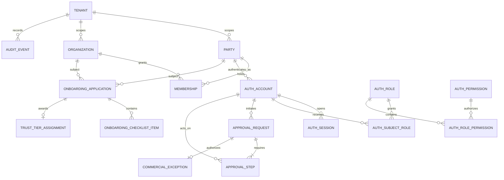
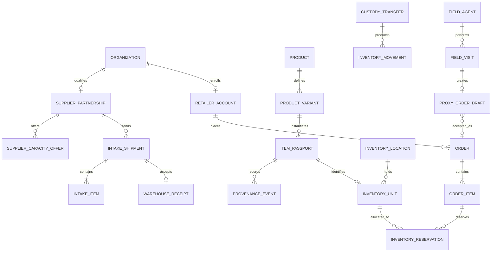
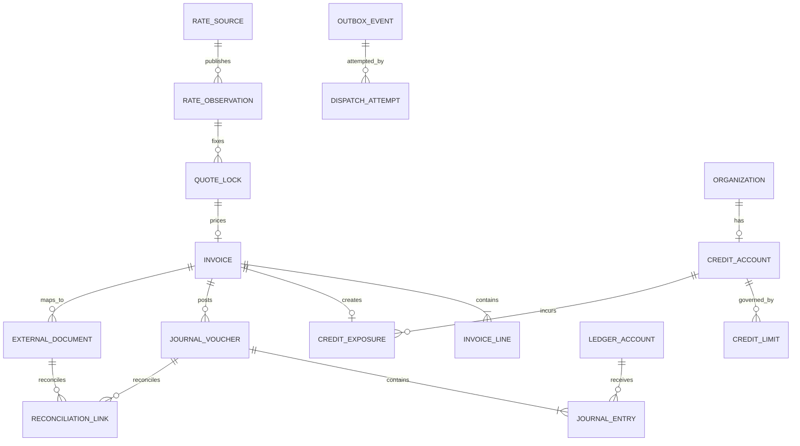
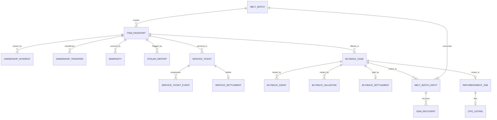
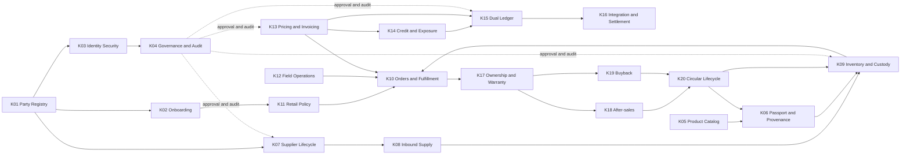

# PostgreSQL Architecture Blueprint — K01 through K20

**Status:** Design proposal; architecture approval required before implementation

**Date:** 2026-09-22 (Asia/Tehran)

**Repository baseline:** `main` at `e68ecead94def23d0d8ad29ad480363827c2db0b`, with the uncommitted Package 1 and Package 2 working tree preserved

**Database shape:** One shared PostgreSQL database, schema-separated bounded contexts, one transactional boundary

**Production release:** Frozen

## 1. Purpose, evidence, and limits

This blueprint is derived from the production-readiness baseline, every report under `docs/implementation/`, the K01 PostgreSQL pilot schema/repository/service, and the K01–K20 TypeScript types, routes, storage classes, and K13↔K14↔K15 bridge services. It is a target architecture, not a claim that the current demo behaviors are valid business policy.

Package 2 established a real PostgreSQL connection, versioned migrations, transactions, and an empty K01 schema. The owner classified the legacy K01 volume data as demo/test data; it is not a migration source. K02–K03 remain JSON-backed and K04–K20 remain process-memory demonstrations.

### Design labels

- **Observed:** directly represented in current code.
- **Proposed standard:** an engineering control needed for correctness; it does not certify a business rule.
- **Assumption:** needed to make the model coherent, but requires confirmation.
- **Owner decision:** a rule that cannot safely be inferred; numbered in section 16.

### Non-goals

This document does not authorize implementation, data migration, authentication rollout, external-provider integration, tax treatment, custody operations, or production use. Seed metrics, Persian display strings, simulated hashes, simulated OTP/WebAuthn, local ERP/Moaddian status, and hard-coded tolerances are not authoritative rules.

## 2. Architectural principles

1. A business fact has one authoritative writer. Other contexts hold foreign keys, immutable snapshots needed for legal documents, or rebuildable projections—not editable duplicates.
2. All tenant-owned tables carry `tenant_id`; every tenant-local unique key begins with `tenant_id`; all tenant-local foreign keys include it. Row-level security is enabled and forced.
3. State transitions are explicit, validated, actor-attributed, and optimistic-concurrency protected. High-risk transitions also require K04 approval.
4. Financial, inventory, custody, ownership, and audit records are append-only after posting. Correction uses reversal or supersession, never destructive editing.
5. Cross-context changes that must be atomic use one short PostgreSQL transaction. Network calls never occur while database locks are held; an outbox commits the intended side effect.
6. Derived totals, names, balances, metrics, and status labels are projections. Authoritative inputs and references are retained.
7. No JSON, seed, or in-memory fallback exists on a PostgreSQL failure.
8. PostgreSQL identifiers are lowercase `snake_case`; timestamps are `timestamptz`; exact values use `numeric`, never floating point.

## 3. Bounded contexts and responsibilities

| Context | Authoritative responsibility | Explicitly not authoritative for |
|---|---|---|
| K01 Party registry | People, organizations, contacts, addresses, memberships, identity-document metadata | Login credentials, trust tier, retailer credit, supplier contracts |
| K02 Onboarding | Applications, verification workflow, trust-tier assignment, commercial entitlement grants | Canonical party data, authentication, credit exposure |
| K03 Identity security | Accounts, credential references, MFA factors, sessions, security policy/events | Party demographics, authorization policy decisions, commercial approvals |
| K04 Governance | Approval policy, maker-checker requests/steps, exceptions, immutable audit anchoring | Performing the approved business mutation itself |
| K05 Product catalog | Product taxonomy, SKU/variant definitions, assets, supplier capacity offers | Serialized physical stock, live price authority |
| K06 Passport/provenance | Unique physical-item identity, assay/QC evidence, item identifiers, provenance events | Current physical custody balance; legal consumer ownership is K17 |
| K07 Supplier lifecycle | Supplier qualification, agreements, supplier-specific collateral, quality/KPI history, consignment limits | Generic party identity, physical intake, buyer credit |
| K08 Inbound supply | Shipment intake, weighing, assay, quarantine decision, warehouse receipt | Ongoing inventory custody after acceptance |
| K09 Inventory/custody | Locations, containers/bags, serialized units, movements, custody transfers, stock audits | Product definition, customer ownership, accounting balance |
| K10 Order fulfillment | Orders, lines, reservations, packages, delivery, POD | Rate authority, invoices, credit limits, physical inventory master |
| K11 Retail commercial policy | Retailer account lifecycle, eligible basket, effective commercial terms/exceptions | Canonical retailer organization, territory, trust verification, credit exposure |
| K12 Field operations | Agents as operational roles, territories/stores, visits/evidence, proxy-order drafts | Party identity, bag custody, final orders |
| K13 Pricing/invoicing | Market observations, governed rate changes, quote locks, wage rules, invoices, tax-submission state | Credit decision, ledger posting, external tax-system truth without acknowledgment |
| K14 Credit/risk | Credit account/limits, exposure reservations, credit collateral, overrides | Ledger balances, supplier collateral, invoice truth |
| K15 Dual ledger | Chart of accounts, vouchers/entries, periods, netting and accounting reconciliation links | Operational order/inventory state, external ERP status |
| K16 Integration/settlement | External endpoints/mappings, dispatch attempts, external documents, settlement orchestration, reconciliation runs | Core invoice, exposure, or journal truth |
| K17 Ownership/warranty | Consumer claims, legal/economic ownership interests and transfers, warranty policies/cards, stolen reports | Physical custody and item manufacture provenance |
| K18 After-sales | Service tickets, custody-stage events, workshop assignments, weight audit, service settlement | Warranty policy, inventory master, accounting posting |
| K19 Buyback | Buyback case, intake assay, valuation snapshot, payout/settlement intent, routing decision | Payment-provider confirmation without evidence; downstream inventory/refining |
| K20 Circular lifecycle | Refurbishment, CPO listing, melt genealogy/mass balance, recovered gems | Source buyback truth, inventory custody, ledger truth |

## 4. Source-of-truth ownership matrix

| Shared business entity/fact | System of record | Consumers | Rule |
|---|---|---|---|
| Tenant/workspace | Platform | K01–K20 | Never inferred from request body |
| Person/party | K01 | K02, K03, K04, K12, K15, K17–K19 | Consumers reference `party_id`; names are display snapshots only |
| Organization/branch | K01 | K02, K05, K07–K16, K18 | Organization and location identity stay in K01 |
| Party↔organization membership | K01 | K03, K04, K11, K12 | Effective-dated; authorization still comes from K03 RBAC |
| Uploaded document metadata/blob | K01 + platform object registry | K02, K04, K07, K14, K17 | Object bytes outside DB; immutable digest and access classification in DB |
| Onboarding application/checks | K02 | K01, K04, K11 | K02 may request K01 changes but not duplicate the party master |
| Trust tier | K02 | K03, K10, K11, K13, K14 | One effective-dated assignment; labels in downstream records are snapshots |
| Commercial entitlement | K02 | K10, K11, K14 | K11 narrows channel terms; it must not silently widen K02 entitlement |
| Account/session/MFA | K03 | All request boundaries | Server-derived actor only; no caller-supplied identity |
| Role/permission grant | K03 | K04 and every API | Tenant-scoped, effective-dated, deny by default |
| Approval/exception | K04 | K02, K07, K09, K13–K20 | Approval authorizes a command; it does not directly mutate foreign state |
| Audit event | Platform/K04 | All contexts | Append-only, centrally formatted, periodically anchored |
| Product/SKU/variant | K05 | K06, K08–K10, K12, K13, K16, K20 | Downstream documents retain immutable commercial snapshots |
| Supplier relationship/agreement | K07 | K05, K08, K14, K15 | Organization identity remains K01 |
| Supplier collateral | K07 | K14 read-only | Separate from buyer-credit collateral unless owner explicitly unifies them |
| Intake assay/receipt | K08 | K06, K07, K09, K15 | Acceptance transaction creates custody/inventory effects once |
| Serialized item/passport | K06 | K08–K10, K17–K20 | K06 owns identity and provenance; status cannot contradict K09/K17 |
| Physical location/custodian | K09 | K06, K10, K12, K14, K18–K20 | Only K09 movement can change current custody |
| Inventory availability/reservation | K09/K10 | K10, K13 | K09 owns on-hand; K10 owns reservation purpose and lifecycle |
| Order/fulfillment/POD | K10 | K12–K16, K17 | Proxy draft becomes a K10 order idempotently |
| Retailer commercial account | K11 | K10, K12, K13 | References K01 organization and K02 tier; no duplicate identity/credit balance |
| Territory/visit | K12 | K10, K11 | K11 references effective territory assignment |
| Market rate observation | K13 | K05, K10, K14–K16, K18–K20 | Every valuation references immutable rate observation/quote |
| Invoice/tax submission | K13 | K14–K16 | Posted invoice content immutable; corrections use credit note |
| Credit limit/exposure | K14 | K10, K13, K15 | Exposure reservation is atomic with business commitment |
| Accounting voucher/entry/balance | K15 | K13, K14, K16, K18–K20 | Balance is derived from posted entries, never directly edited |
| External ERP/tax/payment document | K16 | K13, K15, K19 | External acknowledgment is stored separately from internal intent |
| Consumer ownership/warranty/stolen state | K17 | K06, K10, K18–K20 | K17 owns legal/economic ownership; K06 records provenance consequence |
| Service/repair case | K18 | K09, K15, K17, K20 | Item custody moves through K09; warranty eligibility comes from K17 |
| Buyback/valuation/payout intent | K19 | K09, K13, K15, K16, K20 | Valuation freezes assay and rate inputs; external payment needs acknowledgment |
| Refurbishment/melt/gem genealogy | K20 | K05, K06, K09, K13, K15, K17 | Inputs are consumed once; outputs become new K06/K09 identities |

## 5. Database-wide conventions

### Schemas and keys

Use schemas `platform`, `k01` … `k20`; do not use per-module databases. Primary keys are native `uuid`. New externally visible IDs should be time-ordered UUIDv7 generated by a reviewed application library or approved database extension; until then, cryptographic UUIDv4 is acceptable. Human document numbers are separate, tenant-scoped unique keys and are never primary keys.

Every tenant-owned row has `tenant_id uuid not null references platform.tenants(id) on delete restrict`. Composite foreign keys include `(tenant_id, referenced_id)` to prevent cross-tenant references. Deletion defaults to `restrict`; lifecycle ends through status/effective dates. Cascades are limited to true owned children that have no independent audit/legal life.

### Common columns and audit behavior

Mutable aggregate roots carry `created_at`, `created_by_account_id`, `updated_at`, `updated_by_account_id`, and `version bigint check (version > 0)`. Effective-dated policy rows carry `valid_from` and `valid_to` with `valid_to is null or valid_to > valid_from`. Immutable event/ledger rows use `occurred_at`, `actor_account_id`, `correlation_id`, and `causation_id`; they have no update/delete grant for the application role.

`jsonb` is allowed only for provider payload snapshots, extensible evidence metadata, and audit before/after fragments. Searchable identifiers, amounts, status, tenancy, relationships, and invariants stay typed. Every foreign key gets an index; common tenant queries use `(tenant_id, status, created_at desc)`; partial indexes cover active/pending rows; append-only time-series tables may be time-partitioned only after measured volume justifies it.

### Retention and sensitivity codes

| Code | Proposed treatment |
|---|---|
| R0 | Permanent while a legal/property chain exists; archive, do not erase the event |
| R1 | Active life plus 10 years |
| R2 | 7 years after settlement/closure |
| R3 | 2 years after expiry/revocation |
| R4 | 90 days online, then security archive for 1 year |

Retention direction and legal-hold precedence are approved conditionally under D44–D46; exact periods, procedures and deadlines remain placeholders pending final legal/privacy review. `PUBLIC` is intentionally publishable; `INTERNAL` is operational; `CONFIDENTIAL` includes commercial data; `RESTRICTED` includes direct PII, authentication, financial, custody, legal, or security evidence. Restricted identifiers use application/KMS-backed field encryption or tokenization; hashes are keyed where enumeration is possible. Logs and analytics receive masked values only.

## 6. Proposed table catalog (129 tables)

The constraint column lists notable constraints beyond the database-wide rules above. `T` means tenant-scoped; `G` means platform-global. Retention is the proposed code from section 5.

| # | Owner / table | Scope | Key relationships and constraints | Principal indexes | Class / retention |
|---:|---|:---:|---|---|---|
| 001 | `platform.tenants` | G | PK `id`; unique `slug`; status check | active slug | CONFIDENTIAL / R1 |
| 002 | `platform.document_objects` | T | unique `(tenant_id, sha256, storage_key)`; size ≥ 0; immutable digest | owner, digest | RESTRICTED / R1 |
| 003 | `platform.audit_events` | T | append-only; actor→K03 account; correlation UUID; optional typed target reference | target/time, actor/time | RESTRICTED / R0 |
| 004 | `platform.idempotency_keys` | T | unique `(tenant_id, actor_id, operation, key)`; request hash; response ref; expiry | pending expiry | CONFIDENTIAL / R3 |
| 005 | `platform.outbox_events` | T | unique aggregate version; status/attempt checks; payload `jsonb` | pending `available_at` | CONFIDENTIAL / R2 |
| 006 | `platform.inbox_messages` | T | unique `(tenant_id, source, external_message_id)` | received/status | CONFIDENTIAL / R2 |
| 007 | `platform.retention_holds` | T | target type/id; non-overlapping active legal hold | target, active holds | RESTRICTED / R0 |
| 008 | `platform.reference_sequences` | T | unique `(tenant_id, sequence_type, fiscal_period)`; positive next value | lookup unique | INTERNAL / R2 |
| 009 | `k01.parties` | T | canonical person; status/party-type checks; no raw auth data | status, normalized name | RESTRICTED / R1 |
| 010 | `k01.party_contacts` | T | party FK; contact type/value token; at most one primary/type | party, verified token | RESTRICTED / R1 |
| 011 | `k01.party_addresses` | T | party FK; address type; one active primary/type | party/current | RESTRICTED / R1 |
| 012 | `k01.organizations` | T | canonical legal entity; partial unique legal/national identifiers | type/status, legal token | RESTRICTED / R1 |
| 013 | `k01.organization_locations` | T | organization FK; branch/location code unique; address fields | org/status, geography | RESTRICTED / R1 |
| 014 | `k01.memberships` | T | party+organization FKs; valid date check; no duplicate active role interval | org/role/current, party/current | CONFIDENTIAL / R1 |
| 015 | `k01.entity_documents` | T | object FK; exactly one party/org target; type/status checks | target/type, verification | RESTRICTED / R1 |
| 016 | `k02.onboarding_applications` | T | party/org target; requested tier; version; status transition check | reviewer/status, target | RESTRICTED / R1 |
| 017 | `k02.onboarding_checklist_items` | T | application FK; unique `(application_id, step_key)` | incomplete steps | RESTRICTED / R1 |
| 018 | `k02.verification_calls` | T | application FK; actor account; outcome check; no secrets | application/time | RESTRICTED / R2 |
| 019 | `k02.trust_tier_policies` | T | tier code/effective version unique; limits nonnegative | effective tier | CONFIDENTIAL / R1 |
| 020 | `k02.trust_tier_assignments` | T | subject party/org; non-overlapping effective intervals | subject/current tier | CONFIDENTIAL / R1 |
| 021 | `k02.commercial_entitlements` | T | subject+effective version; limits nonnegative; lock reason required when locked | subject/current | CONFIDENTIAL / R1 |
| 022 | `k03.auth_accounts` | T | party FK; normalized username/email unique per tenant; status check | login identifiers, party | RESTRICTED / R1 |
| 023 | `k03.auth_credentials` | T | account FK; credential type; secret verifier encrypted/hashed; never returned | account/type/current | RESTRICTED / R3 |
| 024 | `k03.auth_mfa_factors` | T | account FK; factor/status checks; secret ciphertext, not preview | account/active | RESTRICTED / R3 |
| 025 | `k03.auth_webauthn_credentials` | T | factor FK; credential ID unique; sign count nonnegative; public key only | credential ID | RESTRICTED / R3 |
| 026 | `k03.auth_sessions` | T | account FK; token hash unique; expiry/revocation checks | token, account/active, expiry | RESTRICTED / R4 |
| 027 | `k03.auth_security_events` | T | append-only; account optional; event/severity checks | account/time, severity/time | RESTRICTED / R2 |
| 028 | `k03.auth_policies` | T | effective policy version; bounded session/attempt settings | current policy | RESTRICTED / R1 |
| 029 | `k04.approval_policies` | T | category/effective version unique; approver count > 0 | category/current | CONFIDENTIAL / R1 |
| 030 | `k04.approval_requests` | T | initiator account; target command hash; expiry/status checks; unique idempotency ref | status/expiry, target | RESTRICTED / R1 |
| 031 | `k04.approval_steps` | T | request FK; unique step number; actor cannot violate policy; immutable after action | request/order, pending role | RESTRICTED / R1 |
| 032 | `k04.commercial_exceptions` | T | approval request FK required for activation; effective dates | subject/current, expiry | RESTRICTED / R1 |
| 033 | `k04.audit_anchors` | T | sequence range non-overlap; digest unique; external anchor receipt optional | sequence/time | RESTRICTED / R0 |
| 034 | `k05.product_families` | T | unique code; optional parent FK; acyclic hierarchy enforced in service | parent, active code | INTERNAL / R1 |
| 035 | `k05.products` | T | family FK; unique product code; fineness class/status checks | family/status, code | CONFIDENTIAL / R1 |
| 036 | `k05.product_variants` | T | product FK; unique SKU/barcode; min ≤ target ≤ max; quantities not stored | product/status, SKU | CONFIDENTIAL / R1 |
| 037 | `k05.product_assets` | T | product/variant + document object FK; one primary per asset type | owner/type | CONFIDENTIAL / R1 |
| 038 | `k05.supplier_capacity_offers` | T | supplier K07 + variant FKs; capacity/MOQ/lead time ≥ 0; validity check | supplier/status, variant/status | CONFIDENTIAL / R2 |
| 039 | `k05.product_commercial_rules` | T | product/category; wage type; effective dates; no overlapping same priority | product/current | CONFIDENTIAL / R1 |
| 040 | `k06.item_passports` | T | unique UID/serial; variant FK; physical nature/status checks | UID, variant/status | RESTRICTED / R0 |
| 041 | `k06.item_identifiers` | T | passport FK; identifier type/value unique (NFC, QR, hallmark, barcode) | type/value | RESTRICTED / R0 |
| 042 | `k06.assay_certificates` | T | passport/intake assay refs; fineness range; evidence object; issuer org | passport/time, certificate no | RESTRICTED / R0 |
| 043 | `k06.item_qc_inspections` | T | passport FK; score 0..100; inspector account; immutable result | passport/time, pass/fail | RESTRICTED / R0 |
| 044 | `k06.item_evidence_assets` | T | passport/event + object FK; evidence type | passport/type | RESTRICTED / R0 |
| 045 | `k06.provenance_events` | T | append-only passport FK; event ordinal unique; previous digest; actor | passport/ordinal, event/time | RESTRICTED / R0 |
| 046 | `k07.supplier_partnerships` | T | supplier organization unique; supplier code unique; grade/status checks | status/grade, org | RESTRICTED / R1 |
| 047 | `k07.supplier_agreements` | T | partnership FK; agreement no unique; effective date/limit checks | supplier/current, expiry | RESTRICTED / R1 |
| 048 | `k07.supplier_collaterals` | T | partnership FK; identifier token unique; amount/weight nonnegative | supplier/status, expiry | RESTRICTED / R1 |
| 049 | `k07.supplier_quality_audits` | T | partnership FK; score 0..100; evidence refs | supplier/time, result | RESTRICTED / R1 |
| 050 | `k07.supplier_kpi_snapshots` | T | supplier+period unique; percentages bounded | supplier/period | CONFIDENTIAL / R2 |
| 051 | `k07.supplier_capacity_limits` | T | supplier/agreement; weight limits nonnegative; effective intervals | supplier/current | CONFIDENTIAL / R1 |
| 052 | `k08.intake_shipments` | T | supplier/agreement FKs; intake code unique; seal/waybill keys | supplier/status, intake code | RESTRICTED / R1 |
| 053 | `k08.intake_items` | T | shipment FK; optional variant; piece/declared weights nonnegative | shipment, variant | RESTRICTED / R1 |
| 054 | `k08.weighing_observations` | T | shipment/item; scale/device ref; immutable measured weight | shipment/time | RESTRICTED / R0 |
| 055 | `k08.assay_tests` | T | shipment/item; method; fineness 0..1000; evidence/issuer refs | shipment/time, packet | RESTRICTED / R0 |
| 056 | `k08.warehouse_receipts` | T | accepted shipment unique; receipt no unique; immutable quantities | supplier/time, receipt | RESTRICTED / R0 |
| 057 | `k09.inventory_locations` | T | K01 location/org FK; unique code; capacity ≥ 0 | type/status, code | RESTRICTED / R1 |
| 058 | `k09.custody_containers` | T | parent location/container; bag/seal serial unique; capacity ≥ 0 | location/status, custodian | RESTRICTED / R1 |
| 059 | `k09.inventory_units` | T | passport FK unique for serialized item; receipt FK; one current location; quantity > 0 | location/status, passport | RESTRICTED / R0 |
| 060 | `k09.inventory_movements` | T | append-only unit; from/to differ; monotonic sequence; reason/ref | unit/sequence, location/time | RESTRICTED / R0 |
| 061 | `k09.custody_transfers` | T | source/destination; state machine; dispatch/arrival weights; approval ref when required | status/ETA, locations | RESTRICTED / R0 |
| 062 | `k09.stock_audits` | T | location; expected/observed quantities; approval for adjustment | location/time, discrepancy | RESTRICTED / R0 |
| 063 | `k10.orders` | T | retailer org; order code unique; channel/status; idempotency FK | retailer/status, created | RESTRICTED / R1 |
| 064 | `k10.order_items` | T | order+variant; quantity/target weight > 0; immutable price snapshot after accept | order, variant | CONFIDENTIAL / R1 |
| 065 | `k10.inventory_reservations` | T | item + order line; only one active reservation/item via partial unique | order/status, item active, expiry | RESTRICTED / R1 |
| 066 | `k10.fulfillment_packages` | T | order; seal serial unique; package weight ≥ 0 | order/status, seal | RESTRICTED / R1 |
| 067 | `k10.deliveries` | T | package/order; waybill unique when present; dispatch state | order/status, ETA | RESTRICTED / R1 |
| 068 | `k10.proof_of_delivery` | T | delivery unique; recipient party/membership where known; immutable evidence | delivery, verified time | RESTRICTED / R1 |
| 069 | `k11.retailer_accounts` | T | retailer organization unique; code unique; lifecycle state | status/tier projection | RESTRICTED / R1 |
| 070 | `k11.commercial_terms` | T | retailer; effective dates; payment tenor/discount/basket limits; approval ref | retailer/current | CONFIDENTIAL / R1 |
| 071 | `k11.retailer_baskets` | T | terms FK; product family/category; min≤max; unique permitted scope | terms/scope | CONFIDENTIAL / R1 |
| 072 | `k11.retailer_exceptions` | T | retailer+K04 approval; effective dates; bounded deltas | retailer/current, expiry | RESTRICTED / R1 |
| 073 | `k12.field_agents` | T | party FK unique while active; operational code unique; clearance/status | territory/status, party | RESTRICTED / R1 |
| 074 | `k12.territories` | T | code unique; geography/risk; quota nonnegative | geography, lead agent | CONFIDENTIAL / R1 |
| 075 | `k12.territory_stores` | T | territory+K11 retailer; non-overlapping effective assignment | retailer/current, territory | CONFIDENTIAL / R1 |
| 076 | `k12.field_visits` | T | agent+retailer+territory; scheduled/check-in state; geospatial evidence ref | agent/date, retailer/date | RESTRICTED / R2 |
| 077 | `k12.visit_evidence` | T | visit; object/device/location evidence; immutable digest | visit/type | RESTRICTED / R2 |
| 078 | `k12.proxy_order_drafts` | T | visit/retailer/agent; idempotency key; accepted draft references K10 order | retailer/status, agent/time | RESTRICTED / R2 |
| 079 | `k13.rate_sources` | T | provider code unique; priority/status; no credential material | active/priority | RESTRICTED / R1 |
| 080 | `k13.rate_observations` | T | source+symbol+observed time unique; buy/sell exact; immutable | symbol/time desc, source/time | CONFIDENTIAL / R2 |
| 081 | `k13.rate_change_requests` | T | proposed rate; operator; K04 approval; old/new observations | status/time, symbol | RESTRICTED / R1 |
| 082 | `k13.quote_locks` | T | opaque token hash unique; buyer; rate observation; expiry/status | token, buyer/status, expiry | RESTRICTED / R1 |
| 083 | `k13.wage_rules` | T | category/tier/effective priority; non-overlap; percentages bounded | category/current | CONFIDENTIAL / R1 |
| 084 | `k13.invoices` | T | invoice/tax numbers unique; buyer/seller org; order/quote refs; totals exact | buyer/status, issue date, tax status | RESTRICTED / R0 |
| 085 | `k13.invoice_lines` | T | invoice+line no unique; SKU snapshot; exact weight/rate/tax components | invoice/order, product code | RESTRICTED / R0 |
| 086 | `k13.tax_submissions` | T | invoice; attempt/idempotency; provider receipt unique; payload digest | status/retry, invoice | RESTRICTED / R0 |
| 087 | `k14.credit_accounts` | T | buyer organization unique; score/status checks | status/risk | RESTRICTED / R1 |
| 088 | `k14.credit_limits` | T | account; gold/fiat limits ≥ 0; effective dates; approval ref | account/current | RESTRICTED / R1 |
| 089 | `k14.credit_exposures` | T | account; source reference unique; amount/weight ≥ 0; reservation state | account/status, source | RESTRICTED / R0 |
| 090 | `k14.credit_collaterals` | T | account; type/identifier unique; haircut 0..100; custody ref | account/status, maturity | RESTRICTED / R1 |
| 091 | `k14.credit_overrides` | T | account; K04 approval; effective bounds; status | account/current, expiry | RESTRICTED / R1 |
| 092 | `k15.ledger_accounts` | T | account code unique; commodity/currency and normal side checks | code, party, active | RESTRICTED / R0 |
| 093 | `k15.journal_vouchers` | T | voucher no unique; source ref unique; status/period; posted immutable | source, status/date | RESTRICTED / R0 |
| 094 | `k15.journal_entries` | T | voucher+line unique; account FK; exactly one debit/credit; exact unit | voucher, account/date | RESTRICTED / R0 |
| 095 | `k15.accounting_periods` | T | fiscal period unique; non-overlap; close/reopen approval refs | status/date | RESTRICTED / R0 |
| 096 | `k15.netting_batches` | T | party/rate observation; approval; immutable result on post | party/status, date | RESTRICTED / R0 |
| 097 | `k15.reconciliation_links` | T | internal voucher + external document; unique pair; variance exact | status, voucher | RESTRICTED / R0 |
| 098 | `k16.integration_endpoints` | T | provider/purpose unique; config references secret name only | provider/status | RESTRICTED / R1 |
| 099 | `k16.external_mappings` | T | endpoint+entity type+internal id/external id unique | internal, external | CONFIDENTIAL / R1 |
| 100 | `k16.dispatch_attempts` | T | outbox event; attempt no unique; status/latency; redacted error | pending/retry, event | RESTRICTED / R2 |
| 101 | `k16.external_documents` | T | provider document id/type unique; internal source; digest/ack state | source, external id, status | RESTRICTED / R0 |
| 102 | `k16.settlements` | T | party; method; source ref unique; amount/weight exact; confirmation state | party/status, date | RESTRICTED / R0 |
| 103 | `k16.reconciliation_runs` | T | period/type; immutable result summary; details in child-like JSON only for diagnostics | type/time, status | RESTRICTED / R0 |
| 104 | `k17.ownership_claims` | T | passport+claimant; proof object; status; approved claim references K04 when required | passport/status, claimant | RESTRICTED / R0 |
| 105 | `k17.ownership_interests` | T | passport+owner; share >0..100; effective interval; active shares total 100 | passport/current, owner | RESTRICTED / R0 |
| 106 | `k17.ownership_transfers` | T | passport; from/to interests; consent proofs; completed immutable | passport/status, parties | RESTRICTED / R0 |
| 107 | `k17.warranty_policies` | T | issuer/product scope; effective version; duration/coverage | issuer/current, product | CONFIDENTIAL / R1 |
| 108 | `k17.warranties` | T | passport unique active warranty as policy allows; owner/retailer/invoice refs | owner/status, expiry | RESTRICTED / R1 |
| 109 | `k17.stolen_reports` | T | passport; reporter; case/status; one active report/passport | passport/active, case no | RESTRICTED / R0 |
| 110 | `k18.service_tickets` | T | ticket/receipt codes unique; passport/owner/warranty/retailer refs | stage/SLA, passport | RESTRICTED / R1 |
| 111 | `k18.service_ticket_events` | T | append-only ticket ordinal; stage transition; actor/location | ticket/ordinal, stage/time | RESTRICTED / R0 |
| 112 | `k18.workshop_assignments` | T | ticket+workshop org; effective dates; dispatch receipt | workshop/status, ticket | RESTRICTED / R1 |
| 113 | `k18.service_weight_audits` | T | ticket; intake/return observations; assay/evidence refs; exact delta | ticket/time | RESTRICTED / R0 |
| 114 | `k18.service_settlements` | T | ticket unique final version; component sum check; K15 voucher ref | payment status, voucher | RESTRICTED / R0 |
| 115 | `k19.buyback_cases` | T | buyback/receipt codes unique; seller party; optional passport; stage | stage/time, seller, passport | RESTRICTED / R1 |
| 116 | `k19.buyback_assays` | T | case; immutable method/weights/fineness/evidence; one accepted result | case/time | RESTRICTED / R0 |
| 117 | `k19.buyback_valuations` | T | case+version; assay/rate refs; exact components; accepted version unique | case/version, status | RESTRICTED / R0 |
| 118 | `k19.buyback_settlements` | T | case; method; idempotency; bank/token refs; K15/K16 refs | status/retry, case | RESTRICTED / R0 |
| 119 | `k19.buyback_routing_decisions` | T | case; destination type/ref; approval; one active decision | destination/status, case | RESTRICTED / R0 |
| 120 | `k20.refurbishment_jobs` | T | source case/ticket/item; item code unique; stage/workshop | stage/workshop, source | RESTRICTED / R0 |
| 121 | `k20.refurbishment_qc` | T | job; score 0..100; weight/evidence; accepted result immutable | job/time, result | RESTRICTED / R0 |
| 122 | `k20.cpo_listings` | T | job/passport; listing code unique; rate/price/warranty refs | status, passport | RESTRICTED / R1 |
| 123 | `k20.melt_batches` | T | batch no unique; status; input/output totals nonnegative; assay ref | status/time, batch no | RESTRICTED / R0 |
| 124 | `k20.melt_batch_inputs` | T | batch+inventory unit unique; input weight/fineness exact; consumed once | batch, inventory unit | RESTRICTED / R0 |
| 125 | `k20.gem_recoveries` | T | recovery code unique; source input; carat/value exact; K09 location ref | status/location, source | RESTRICTED / R0 |
| 126 | `k03.auth_roles` | T | role key unique; system/custom type; status; no implicit wildcard | key/status | RESTRICTED / R1 |
| 127 | `k03.auth_permissions` | G | permission key unique; bounded action/resource classification | resource/action, key | INTERNAL / R1 |
| 128 | `k03.auth_role_permissions` | T | role+permission unique; optional constraint scope; deny/allow check | role, permission | RESTRICTED / R1 |
| 129 | `k03.auth_subject_roles` | T | account+role+organization scope; effective interval; no duplicate active grant | account/current, role/scope | RESTRICTED / R1 |

Metrics currently stored in demo payloads are views/materialized projections, not tables. Examples include K07 KPIs, K09 network weight, K11 purchase history, K14 utilization, K15 trial balance, K16 reconciliation summaries, and K20 circular-economy metrics.

## 7. Numeric and temporal standards

These are exact proposed storage standards. Statutory presentation and policy thresholds remain owner/legal decisions.

| Quantity | PostgreSQL type / unit | Constraint and calculation rule |
|---|---|---|
| Money | `numeric(28,6)` plus `currency_code char(3)` | No float. IRR must have zero fractional digits. Toman is presentation input/output only and converts exactly as `1 toman = 10 IRR`; existing `*Toman` contracts require an explicit compatibility plan (D26). |
| Gold mass | `numeric(24,6)` grams | Resolution 0.000001 g; nonnegative except signed ledger entries/deltas. Raw observations are immutable. |
| Fineness | `numeric(7,3)` parts per thousand | `0.000 <= fineness <= 1000.000`; 18K is represented as 750.000, not 0.750. |
| Fine-gold equivalent | compute at `numeric(38,12)` | `gross_or_net_grams * fineness / 1000`; store final `numeric(24,6)` and retain source mass/fineness IDs. |
| Gem mass | `numeric(18,6)` carat | Nonnegative; never mixed with gold grams. |
| Rates | `numeric(28,8)` currency units per gram/unit | Rate observation is immutable; every valuation references its ID and observed time. |
| Percent/risk ratio | `numeric(9,6)` percent | Stored as percent points (`2.5` means 2.5%), normally 0..100; signed adjustments require explicit check bounds. |
| Counts | `bigint` | Nonnegative; `integer` only for bounded ordinals/scores. |
| Time | `timestamptz` UTC | Jalali/localized strings are presentation only; legal business date is a separate `date` where needed. |

Intermediate arithmetic never rounds. Proposed default rounding at a persisted commercial/ledger boundary is round-half-to-even: money to the currency scale, gold to 0.000001 g, fineness to 0.001‰, and percentages to 0.000001 percentage point. PostgreSQL's built-in two-argument `round(numeric, scale)` is not used as a substitute for half-even; a single tested database/application decimal routine must implement it. Tax-authority, invoice-line, assay, and physical-scale rounding rules override this default only after decisions D27–D29 and must be versioned with the calculation policy. Summed documents are calculated from rounded authoritative lines, and header totals must equal line totals exactly.

## 8. Invariants

### Financial and credit

- A posted K15 voucher is immutable and belongs to an open accounting period. Correction is a linked reversing voucher.
- For each voucher and unit, total debits equal total credits exactly. Gold and fiat never balance against one another; conversion creates balanced legs in each unit using a referenced K13 rate.
- Derived account balance equals the sum of posted entries; no API writes a balance field.
- An invoice can finalize only once. Its totals equal its immutable lines, applied discounts, and tax components. A credit note references the original invoice.
- A quote lock must be active, unexpired, scoped to the buyer/purpose, and consumed at most once.
- Credit availability is `effective limit + approved temporary limit - active reservations - posted exposure`; the update locks the K14 credit account row and rejects a negative result.
- Collateral nominal value, haircut, effective value, custody/verification state, and valuation observation remain separately traceable. An expired/released asset contributes zero coverage.
- External payment, ERP, or tax submission success requires a provider acknowledgment; local dispatch is not success.

### Inventory, custody, and ownership

- Each serialized K06 passport maps to at most one active K09 inventory unit. Each unit has exactly one current location/container derived from its movement chain.
- An inventory unit cannot be simultaneously available, reserved, in transit, delivered, consumed, or melted. State transitions use row locks and compare expected version/state.
- One active K10 reservation exists per serialized unit. Reservation activation and unit availability change are atomic.
- Custody transfer dispatch locks all units in deterministic UUID order, records source custody, and creates one in-transit state. Arrival records destination observation and closes the transfer once.
- K09 custody and K17 ownership are different facts. A transfer of one does not imply the other unless an approved workflow commits both effects.
- Accepted K08 receipt, K09 inventory creation, K06 provenance, supplier exposure/ledger effect, and outbox event commit together when all are required; failure rolls back all.
- A K20 melt input may be consumed once. Batch output fine-gold plus recorded recoveries/loss must reconcile to input fine-gold under an owner-approved tolerance; no silent plug amount.
- Refurbishment preserves source genealogy. A new/reissued passport links to the prior passport and process job; history is never overwritten.

### Pricing and settlement

- K13 is the only rate authority. K05/K10/K14–K20 store referenced snapshots, not independently editable market rates.
- Every price/valuation records rate observation, calculation-policy version, exact inputs, and rounding outcome.
- K13 invoice, K14 exposure, and K15 voucher finalization uses one database transaction; K16 external delivery is an outbox consequence.
- Netting locks affected accounts in sorted UUID order, references one rate observation, posts balanced vouchers, and is idempotent.
- Settlement state distinguishes requested, dispatched, provider-acknowledged, posted, reconciled, failed, and reversed.

### Four-eyes and audit

- Initiator cannot approve their own request; distinct account IDs are mandatory and, where policy requires, distinct people are resolved through K03→K01.
- Approver role, tenant, organization scope, MFA/step-up state, and policy validity are checked at action time.
- Approval steps are append-only after action. The approved command hash and material parameters must match the executed command; changed data requires a new request.
- High-risk mutation and its consumed approval reference commit together. Approval cannot be reused.
- Audit records are inserted in the same transaction as the business mutation, contain server-derived actor/correlation context, omit secrets, and cannot be updated/deleted by the application role.

## 9. Cross-context transaction boundaries

| Workflow | One local PostgreSQL transaction | After commit through outbox |
|---|---|---|
| K02 approval | K02 decision/tier/entitlement + authorized K01 mutation + audit | Notifications/screening follow-up |
| K08 intake acceptance | Receipt + K09 unit/movement + K06 provenance + K07 utilization + optional K15 obligation | Supplier notice/external warehouse sync |
| K09 custody dispatch/arrival | Transfer, locked units, movements, container totals, audit | Tracking/notification |
| K10 allocation | Order lines, K09 availability locks, reservations, order state | Packing tasks/notifications |
| K13 finalization | Consume quote, freeze invoice, reserve/post K14 exposure, post K15 voucher, audit | K16 ERP/tax dispatch |
| K15 netting | Lock accounts ordered by UUID, create batch/vouchers/entries, audit | ERP reconciliation |
| K17 ownership transfer | Consent/transfer, close/open interests, K06 provenance, audit | Deed delivery/notification |
| K18 stage with custody | Ticket event + K09 movement/custody + weight observation | Workshop/carrier message |
| K19 settlement | Freeze valuation, settlement intent, K15 voucher/reservation, K09 intake state, audit | Bank/wallet dispatch through K16 |
| K20 melt completion | Consume inputs, mass-balance result, new K06 passport/K09 unit, K15 entries, provenance/audit | Certificate/ERP dispatch |

Transactions must be short: validate external evidence before beginning; use `select … for update` only on affected roots; acquire locks in deterministic `(table class, tenant_id, id)` order; set statement/lock timeouts; retry serialization/deadlock failures only with an idempotency key.

## 10. Authentication, RBAC, isolation, audit, idempotency, and outbox

### Authentication and RBAC

K03 must validate the session/token before any K01–K20 router. The request context contains immutable `tenant_id`, `account_id`, `party_id`, session assurance/MFA time, roles, correlation ID, and client metadata. Actor fields from bodies/headers are ignored. Credentials, TOTP seeds, recovery codes, and session tokens are never stored plaintext or logged.

RBAC uses roles, permissions, and scoped grants represented through K03 account/policy records plus effective K01 organization membership. Permissions are action-oriented (`k09.transfer.dispatch`, `k15.voucher.post`) and deny by default. K04 adds approval, not base permission. Service/database roles are split into migrator, runtime, outbox worker, read-only support, and backup; the runtime is not owner/superuser and cannot bypass forced RLS.

### Organization isolation and RLS

At transaction start the runtime sets transaction-local, validated context such as `app.tenant_id` and `app.account_id`; pooled connections reset it on checkout/return. RLS policies use indexed `tenant_id` and scoped membership/permission helper functions in a private schema with fixed `search_path`. Table owners do not serve application traffic. Cross-tenant support access requires an explicit time-bounded grant and produces a security/audit event.

### Audit, idempotency, inbox/outbox

All mutating APIs require an idempotency key where retry could duplicate value, custody, payment, approval, or external dispatch. The stored request hash prevents the same key from being reused with a different payload. The business mutation, audit event, and outbox event commit together. Workers claim outbox rows with `for update skip locked`, use exponential backoff and bounded attempts, and move exhausted work to a review state—not a false success. Consumers use `platform.inbox_messages` for at-least-once deduplication. Exactly-once business effect comes from unique source references and atomic upserts, not transport claims.

## 11. ER diagrams

The diagrams intentionally show authoritative relationships, not every catalog table.

### K01–K04

### K05–K12

### K13–K16

### K17–K20

### High-level K01–K20 relationship

## 12. K01 pilot assessment

**Overall assessment: Modify.** The pilot is a sound connectivity/transaction proof and should evolve in place through additive migrations, but it is not the final cross-platform identity schema.

| Current table/design choice | Classification | Blueprint disposition |
|---|---|---|
| `k01_parties` | Modify | Preserve data/API mapping; move to native UUID key, add tenant/audit columns, normalize contacts/addresses and high-integrity role profiles, encrypt/tokenize national ID. |
| `k01_organizations` | Modify | Add tenant/audit columns, native UUID, branch/location model, normalized identifiers/contacts; remove operational profiles owned by K07/K11/K18. |
| `k01_memberships` | Modify | Keep explicit party/org FKs and effective dates; add tenant-composite FKs, version/actor, active-role uniqueness, overlap prevention, and separate RBAC grants from descriptive membership authority. |
| `k01_documents` | Replace | Replace polymorphic `target_type/target_id` with `k01.entity_documents` plus `platform.document_objects`, typed XOR target FKs, immutable digest, sensitivity/access/retention metadata. |
| `k01_audit_events` | Replace | Consolidate into append-only `platform.audit_events`; derive actor from K03 context, add tenant/correlation/causation, structured redacted changes, and K04 anchoring. |
| PostgreSQL pool, lazy connection, redacted errors, shutdown | Keep | Reuse as the shared foundation; add transaction-local security context, role separation, and operational telemetry. |
| Repository + service + transaction boundary | Keep | Continue per context; repositories accept a transaction/context, services own cross-table invariants. |
| Entity mutation + audit in one transaction | Keep | Generalize to the central audit/outbox pattern. |
| Optimistic `version` | Keep | Extend to all mutable aggregate roots and require compare-and-swap updates. |
| Text IDs with prefixes around random UUIDs | Modify | Migrate internal PK/FK to native UUID; retain a separate human/external code where useful. |
| JSONB profile columns | Modify | Retain only genuinely sparse extension metadata; move queried/validated/cross-module fields to typed owner tables. |
| Tenant-scoped normalized mobile/national/legal ID | Approved for 3A | D02 applies tenant-scoped person uniqueness; D03 remains open for future cross-tenant identity. |
| Global `public` schema with `k01_` prefixes | Modify | Move toward bounded-context schemas while using compatibility views during migration. |
| Clean empty production start and no JSON fallback | Keep | Legacy demo data remains excluded. No automatic seed/import path. |

Package 3A applies additive schema migrations to a fresh empty production K01 database. It introduces native UUIDs and tenant IDs without business-data backfill or legacy-ID mapping; a bounded API compatibility adapter may translate old contracts to the single new persistence model. Text legacy columns are retired only after contract verification and the compatibility window. No destructive rewrite is the first migration.

## 13. Migration plan that minimizes schema rework

### Phase 0 — Architecture decisions and policy fixtures

Resolve the owner-decision register, especially tenancy, units/currency, identity uniqueness, tax/rounding, custody, credit, ledger, and retention. Convert approved rules into versioned policy fixtures and executable invariant tests before domain migrations.

### Phase 1 — Shared security and data-control substrate

Add tenant, K03 authentication/RBAC, K04 approvals, central audit, idempotency, inbox/outbox, document-object metadata, RLS, least-privilege roles, correlation context, and test harnesses. Adapt K01 without changing its external contract until authorization/tenant tests pass.

### Phase 2 — K01–K04 convergence

Normalize K01, migrate K02 from JSON, replace simulated K03 security with real enforcement, and persist K04 approvals/audit anchors. Remove caller-supplied actors. Validate cross-tenant denial, four-eyes, concurrency, backup/restore, and audit completeness.

### Phase 3 — Master and physical-gold chain K05–K09

Persist catalog/supplier/intake/passport/custody in dependency order. Establish immutable measurement/evidence records, serialized item identity, inventory movement ledger, deterministic locking, and mass/fineness conversions before any order migration.

### Phase 4 — Commercial execution K10–K12

Persist retailer policy, territories/agents, orders, reservations, fulfillment, and POD. Keep credit and price calls read-only until the K13–K15 transaction is available. Prove no double allocation under concurrency.

### Phase 5 — Controlled finance K13–K16

Implement immutable rate observations, versioned calculation policies, invoices, credit reservations, double-entry ledger, settlement states, and real transactional outbox adapters. Require independent financial/tax review and property/concurrency tests before enabling external dispatch.

### Phase 6 — Consumer and circular chain K17–K20

Persist ownership/warranty, service custody, buyback/payout, refurbishment/melt/gem genealogy. Make every ownership/material/financial transition reconcile across K06/K09/K15 and prove mass balance and idempotency under retries.

### Phase 7 — Cutover and assurance

For each context: inventory/classify source data; rehearse migration in isolation; reconcile counts and business totals; shadow-read; freeze writes briefly if required; cut over one writer; monitor; retain a rollback-compatible database backup. Never use JSON/in-memory fallback. Finish with restore, outage, failover, load, security, RLS, financial, custody, and external-sandbox evidence.

## 14. Operational PostgreSQL requirements

- Use PgBouncer transaction pooling or a bounded application pool sized to the deployment; reserve connections for migrations/operations and set connect, lock, statement, idle-in-transaction, and readiness timeouts.
- Apply migrations with a dedicated non-runtime role and an advisory lock. Use expand/backfill/contract migrations; build large indexes concurrently outside transaction where appropriate; validate constraints after backfill.
- Index every FK and RLS predicate. Prefer composite tenant/equality/range indexes and partial active/pending indexes. Add indexes from measured query plans rather than speculative duplication.
- Backups are encrypted, off-host, point-in-time capable, and restore-tested. RPO/RTO are owner decisions, not implied by a successful backup.
- Monitor pool saturation, query latency, blocked locks, deadlocks, replication/backup lag, autovacuum, table/index growth, outbox age, failed dispatch, RLS denial, and invariant violations.
- Partition only high-volume immutable streams (`audit_events`, provenance, movements, security events) after volume/retention evidence; partition keys must preserve tenant and time access patterns.

## 15. Approved constraint and assumptions requiring validation

**Approved tenant constraint (D01):** The initial production model has exactly one tenant, **Didar**. Retailers, suppliers, factories, branches, stores, workshops, agents, and all other participants are organizations, locations, memberships, or operational roles inside the Didar tenant; they are not independent tenants. Every tenant-owned table still carries `tenant_id` to preserve a future multi-tenant evolution path, but initial production does not include multi-tenant provisioning.

Remaining assumptions:

1. Organizations, retailers, suppliers, workshops, and agent offices are roles/profiles of K01 organizations rather than independent identity masters.
2. K09 owns custody while K17 owns consumer ownership; current K06 holder/owner fields become projections.
3. K13 is the sole price/rate authority and K15 the sole accounting authority.
4. Cross-context atomic writes are acceptable inside a modular monolith while context ownership is enforced in code and grants.
5. External blobs remain in object storage; PostgreSQL stores metadata, hashes, classification, and access controls.
6. Existing JSON, in-memory, seed, demo and test records are never production migration inputs for Package 3A.

## 16. Owner-decision register (48 decisions)

1. **D01 — Tenant boundary — APPROVED (2026-09-22):** Initial production has exactly one tenant, Didar. Retailers, suppliers, factories, branches, stores, workshops, agents, and other participants are modeled inside that tenant as organizations, locations, memberships, or operational roles. All tenant-owned tables retain `tenant_id` for future expansion; multi-tenant provisioning is out of scope for the initial release.
2. **D02 — Person uniqueness — APPROVED (2026-09-23):** National ID, E.164 mobile and normalized email are tenant-scoped unique; foreign/missing identifiers use a stable internal unverified identity; no automatic merge.
3. **D03 — Cross-tenant identity:** Decide whether the same person/legal organization may appear in multiple tenants and how consent/linkage works.
4. **D04 — Organization hierarchy — APPROVED (2026-09-23):** Legal organizations are separate from owned operational locations; hierarchy cannot cross tenants or cycle.
5. **D05 — Membership authority — APPROVED (2026-09-23):** K01 membership is descriptive/effective-dated and grants no permission; K03 exclusively owns authorization.
6. **D06 — Identity documents — APPROVED (2026-09-23):** Private encrypted object storage holds bytes; PostgreSQL holds metadata, digest, classification, object key and verification state only.
7. **D07 — Trust tiers:** Reconcile the duplicate K02 tier vocabularies and define exact eligibility, limits, downgrade, suspension, and effective-date rules.
8. **D08 — Onboarding controls:** Define required checks, screening providers, reviewer roles, conditional approval, re-verification, and rejection appeal.
9. **D09 — Identity provider:** Select authoritative authentication/credential provider and account linking, recovery, passwordless/password policy.
10. **D10 — MFA/session policy:** Define roles/actions requiring MFA or step-up, allowed factors, assurance lifetime, session timeout, concurrency, and revocation.
11. **D11 — Four-eyes policy:** Define governed action categories, thresholds, number/order of approvers, eligible roles, expiry, escalation, and emergency override.
12. **D12 — Audit assurance:** Define legal retention, independent anchor/timestamp provider, evidence export, verifier custody, and admissibility requirements.
13. **D13 — Product taxonomy:** Approve category/family/subcategory vocabulary, SKU uniqueness scope, variant identity, archival, and versioning.
14. **D14 — Supplier capacity:** Define whether offers reserve capacity, overlap rules, units, expiration, acceptance, and relation to agreements.
15. **D15 — Passport trust:** Define UID/NFC/QR issuance, collision/security requirements, signing authority/HSM, key rotation, and public verification disclosure.
16. **D16 — Assay authority:** Approve accepted methods/labs/devices, calibration evidence, certificate uniqueness, fineness tolerance, and dispute workflow.
17. **D17 — Ownership semantics:** Define legal, beneficial, consignment, pledged, and physical-holder interests and whether fractional ownership is allowed.
18. **D18 — Collateral ownership:** Decide whether K07 supplier collateral and K14 buyer collateral can share instruments and which context governs each lifecycle.
19. **D19 — Intake acceptance:** Define seal, weight, piece, fineness, sampling, quarantine, penalty, rejection, and approval thresholds.
20. **D20 — Inventory granularity:** Decide serialized piece versus fungible lot inventory, split/merge rules, tare/gem treatment, and negative-stock prohibition.
21. **D21 — Custody control:** Define dual custody, eligible custodians, container nesting, seal/device evidence, geofencing, insurance, and handoff requirements.
22. **D22 — Reservation/allocation:** Define allocation priority, partial allocation, expiry, substitution, cancellation, and oversell handling.
23. **D23 — POD acceptance:** Approve recipient authority, OTP/signature evidence, weight/seal discrepancy tolerances, dispute and reversal flow.
24. **D24 — Retail policy ownership:** Reconcile K02 entitlement, K11 tier/terms, and K14 credit so no module independently widens another's control.
25. **D25 — Field evidence:** Define territory exclusivity, geofence radius, offline check-in, device attestation, location privacy/retention, and proxy-order consent.
26. **D26 — Currency:** Choose canonical stored currency/unit (recommended IRR), Toman API/display compatibility, supported foreign currencies, and conversion ownership.
27. **D27 — Rate governance:** Approve sources, symbols, buy/sell meaning, freshness, spread, market hours, manual override, circuit breaker, and fallback behavior.
28. **D28 — Rounding:** Approve half-even or alternative rules for gold, invoice line/header, discount, tax, settlement, ledger, and provider payloads.
29. **D29 — Tax/legal invoicing:** Obtain authoritative VAT/taxability, tax ID, credit note, consolidation, Moaddian schema/signing/retention rules.
30. **D30 — Quote locks:** Define required transactions, lock duration, price side, quantity tolerance, consumption, expiry, revocation, and concurrency.
31. **D31 — Exposure timing:** Define when orders/quotes/invoices reserve or post gold/fiat exposure and when cancellation/payment releases it.
32. **D32 — Credit/collateral policy:** Approve limits, score/risk calculation, haircuts, maturities, coverage, warning/lock thresholds, and revaluation frequency.
33. **D33 — Ledger design:** Approve chart of accounts, debit/credit signs, gold fineness subledgers, party accounts, document types, and source mappings.
34. **D34 — Period/reversal control:** Define fiscal calendar, close/reopen authority, backdating, correction, reversal, accrual, and aging rules.
35. **D35 — Settlement/netting:** Define eligible obligations, bilateral/multilateral rules, conversion rate, fees, authorization, bank confirmation, and partial failure handling.
36. **D36 — External integrations:** Approve ERP/Moaddian/bank contracts, sandbox evidence, external ID mapping, retry/dead-letter, reconciliation, and outage policy.
37. **D37 — Ownership transfer proof:** Define seller/buyer authentication, OTP/signature/deed, cooling-off, minors/representatives, stolen-item block, and dispute reversal.
38. **D38 — Warranty:** Define issuer, coverage, start/expiry, transferability, exclusions/tamper, claim limits, and service authorization.
39. **D39 — Service/repair:** Define intake custody, workshop eligibility, weight-loss tolerance, gem replacement consent, quote approval, SLA, refund/exchange, and warranty accounting.
40. **D40 — Buyback compliance:** Define seller KYC/AML/sanctions/stolen checks, cash/bank limits, source-of-funds/evidence, and mandatory holds.
41. **D41 — Buyback valuation:** Approve benchmark side, provenance premium, trade-in incentive, deductions, gem value, offer expiry, and acceptance evidence.
42. **D42 — Melt/refining:** Define batch eligibility, input/output sampling, permitted mass/fineness loss, by-products, assay dispute, and approval of variance.
43. **D43 — Gem custody:** Define grading standard, lab/gemologist authority, identity/sealing, vault location, valuation, remount, and disposal.
44. **D44 — Retention schedule — APPROVED-CONDITIONAL (2026-09-23):** Versioned class-based schedule and legal-hold precedence are approved; exact durations require final legal/privacy approval.
45. **D45 — Privacy rights — APPROVED-CONDITIONAL (2026-09-23):** Purpose/legal basis and verified, redacted, audited rights handling are approved; exact procedures/deadlines require legal/privacy approval.
46. **D46 — Deletion — APPROVED-CONDITIONAL (2026-09-23):** No public hard delete; restrict/disable precedes eligible anonymization/tokenization; exact exceptions/procedure require legal/privacy approval.
47. **D47 — Shared/reference data — PACKAGE 3A PORTION APPROVED (2026-09-23):** Fixed read-only technical vocabulary may be global; mutable K01 business/reference policy is tenant-scoped and versioned. Other domains remain open.
48. **D48 — Operational objectives:** Approve availability/SLO, RPO/RTO, failover region, backup frequency, restore evidence, and incident ownership.

## 17. Recommended next implementation sequence

**Package 3 is an umbrella, not one simultaneous implementation.** The approved sequencing is defined in `docs/architecture/phase-01-owner-decisions.md` as Packages 3A through 3F. **Package 3A — Single-Tenant Identity and Organization Foundation** is READY to start under `docs/roadmap/package-3a-implementation-plan.md`. Authentication, RBAC, approval/audit, idempotency/outbox, and operational acceptance follow as separate gated packages; K02–K20 business persistence remains out of scope.

## 18. Design-only confirmation

This blueprint is the only file created for this task. No application code, migration, database content, dependency, configuration, Docker file, test, business data, or Git history was modified.
